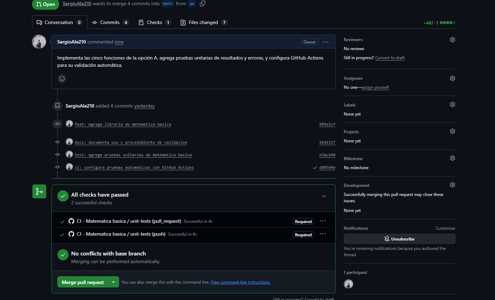
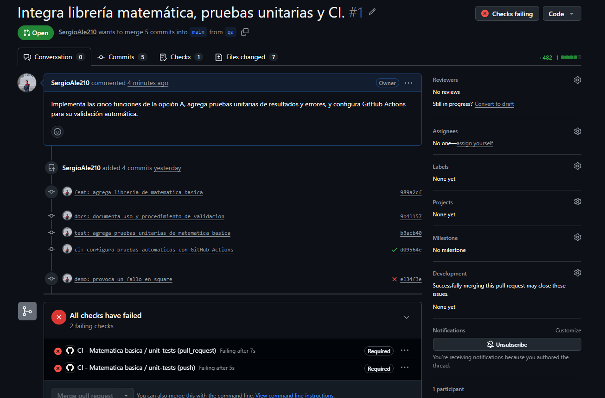
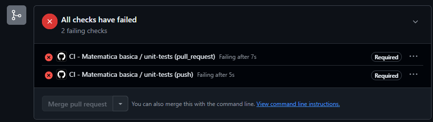
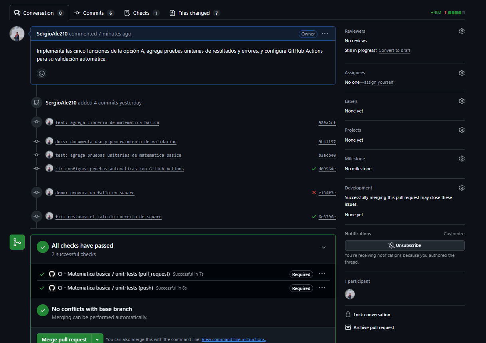

# Prueba en vivo - Opción A

Procedimiento para comprobar las funciones y demostrar el bloqueo de un
Pull Request con pruebas fallidas. Los comandos se ejecutan en PowerShell
desde la raíz del repositorio.

## 1. Requisitos de la demostración

- Python 3.12 y cambios del proyecto confirmados en Git.
- Librería integrada en `qa` y pruebas disponibles en `tests/test_core.py`.
- Pruebas basadas en `unittest.TestCase`, con métodos llamados `test_*`.
- Tests y workflow publicados en GitHub, con `main` protegida.

Para integrar los cambios confirmados de desarrollo en la rama de validación:

```powershell
git switch qa
git merge dev
```

Las pruebas verifican resultados con `assertEqual`, `assertTrue` o
`assertFalse`, y excepciones con `assertRaises`.

## 2. Casos que deben cubrir los tests

| Función | Dos casos exitosos | Casos borde y de error |
| --- | --- | --- |
| `square` | `square(3) == 9`; `square(-4) == 16` | `square(0) == 0`; `square("3")` genera `TypeError`. |
| `factorial` | `factorial(3) == 6`; `factorial(5) == 120` | `factorial(0) == 1`; `factorial(-1)` genera `ValueError`. |
| `is_prime` | `is_prime(2) is True`; `is_prime(9) is False` | `is_prime(1) is False`; `is_prime(2.5)` genera `TypeError`. |
| `gcd` | `gcd(12, 18) == 6`; `gcd(7, 5) == 1` | `gcd(0, 0) == 0`; `gcd(-12, 18) == 6`; `gcd("12", 18)` genera `TypeError`. |
| `lcm` | `lcm(4, 6) == 12`; `lcm(3, 5) == 15` | `lcm(0, 5) == 0`; `lcm(-4, 6) == 12`; `lcm(4, 2.5)` genera `TypeError`. |

La cobertura incluye también el rechazo de booleanos y argumentos inválidos
en ambas posiciones de `gcd` y `lcm`, incluso si el otro argumento es cero.

Comando de ejecución de la suite, que requiere la carpeta `tests/`:

```powershell
python -m unittest discover -s tests -p "test_*.py" -v
```

Debe ejecutar casos de las cinco funciones y finalizar con `OK`.
**`Ran 0 tests` no valida la práctica.**

## 3. Integración continua y protección de main

El archivo `.github/workflows/ci.yml` ejecuta las pruebas en pushes a `qa` y
`main`, y en cada PR hacia `main`. El job se llama `unit-tests` y rechaza una
suite sin pruebas. No requiere instalar dependencias adicionales.

Para publicar el workflow y su documentación desde `qa`:

```powershell
git add .github/workflows/ci.yml README.md docs/PRUEBA_EN_VIVO.md
git commit -m "ci: configura pruebas automaticas con GitHub Actions"
git push origin qa
```

Con el repositorio público, configura la protección desde GitHub:

1. En **Actions**, comprueba que `CI - Matematica basica` termina con `unit-tests` aprobado.
2. En **Settings → Rulesets**, crea un branch ruleset llamado `Proteccion main`, con estado **Active**, bypass vacío y el patrón de destino `main`.
3. Activa **Require a pull request before merging**, con **Required approvals** en `0` para esta demostración.
4. Activa **Require status checks to pass** y agrega `unit-tests` de GitHub Actions. Activa **Require branches to be up to date before merging**.
5. Mantén **Restrict deletions** y **Block force pushes** activados, y **Restrict updates** desactivado. Guarda el ruleset.

El workflow ejecuta las pruebas; la regla de protección es la que bloquea el
merge cuando fallan. No se necesita trasladar estos archivos a `dev` para el
recorrido `qa` → PR hacia `main`.

Referencia de configuración:
[protección de ramas de GitHub](https://docs.github.com/en/repositories/configuring-branches-and-merges-in-your-repository/managing-protected-branches/about-protected-branches).

## 4. Demostrar fallo y corrección

Con los tests y la protección listos, trabaja en `qa`. Cambia temporalmente en
`basic_math/core.py` el retorno de `square` de `return n * n` a `return n + n`.
Ejecuta los tests: `square(3)` devuelve `6` y su prueba debe fallar.

```powershell
python -m unittest discover -s tests -p "test_*.py" -v
git add basic_math/core.py
git commit -m "demo: provoca un fallo en square"
git push origin qa
```

Abre manualmente el PR **`qa` hacia `main`**. Muestra la ejecución fallida de
Actions y el merge bloqueado. Mantén el PR abierto para corregirlo.

Restaura `return n * n` en `square` y ejecuta:

```powershell
python -m unittest discover -s tests -p "test_*.py" -v
git add basic_math/core.py
git commit -m "fix: restaura el calculo de square"
git push origin qa
```

En el mismo PR, muestra las pruebas aprobadas y el merge habilitado. Realiza el
merge desde GitHub después de verificar el resultado.

El método **Merge pull request** conserva los commits individuales del fallo y
la corrección. Puede mantenerse el mensaje predeterminado de GitHub, que
identifica el número de PR y la rama de origen.

## 5. Evidencias

Las capturas corresponden al PR de `qa` hacia `main` y están guardadas en
`images/`, en la raíz del repositorio.

### 1. Estado inicial aprobado

Las pruebas obligatorias están aprobadas y el merge está habilitado.



### 2. Commit con el fallo intencional

El commit `demo: provoca un fallo en square` aparece con las verificaciones fallidas.



### 3. Merge bloqueado

Los checks obligatorios fallan y el botón de merge está deshabilitado.



### 4. Corrección aprobada

El commit de corrección tiene los checks aprobados y el merge vuelve a estar habilitado.


